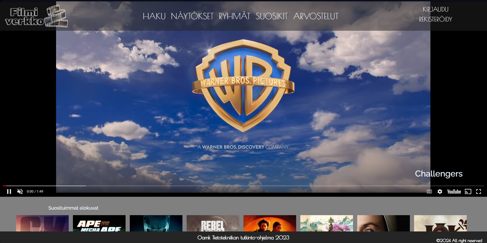
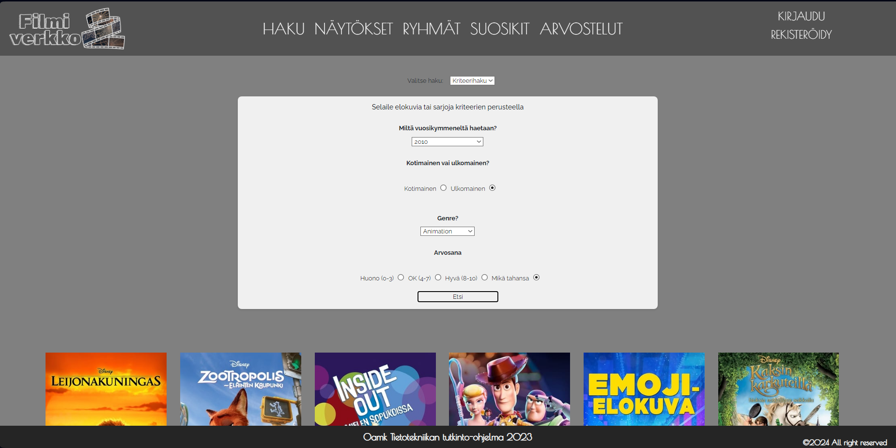
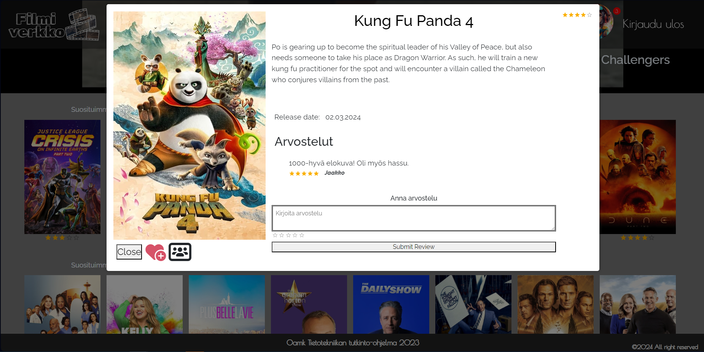
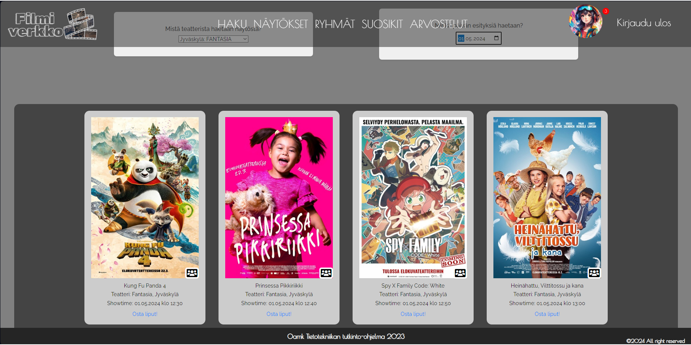
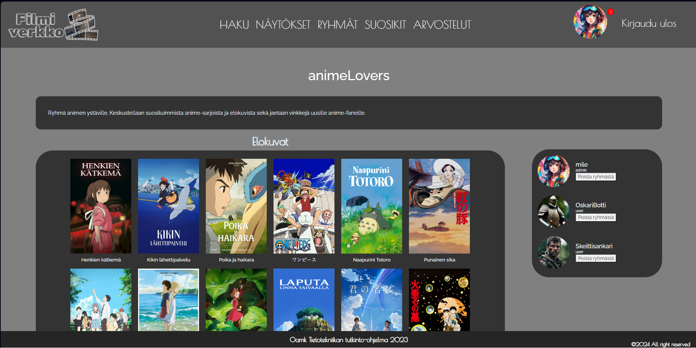
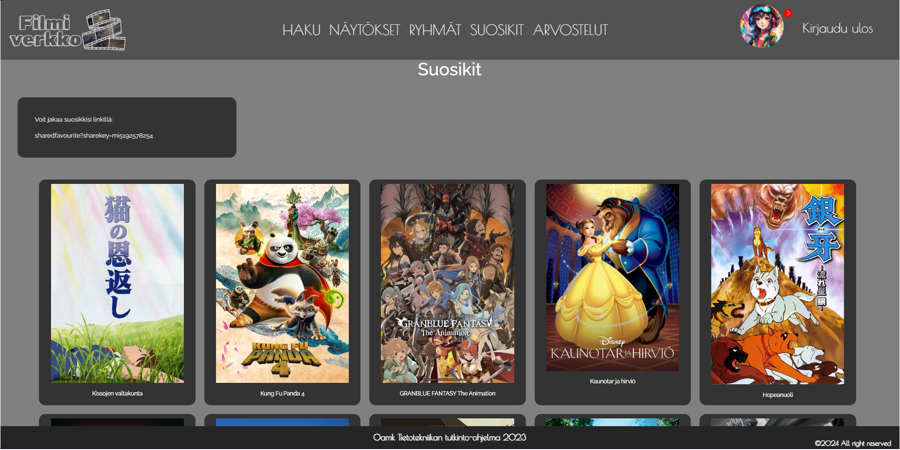
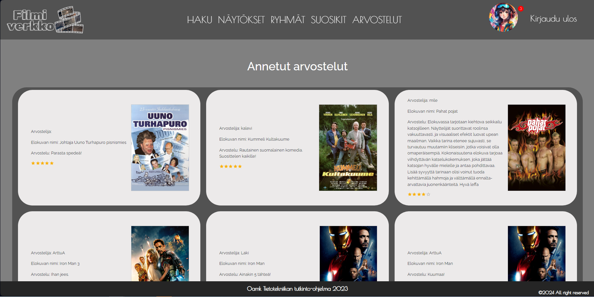
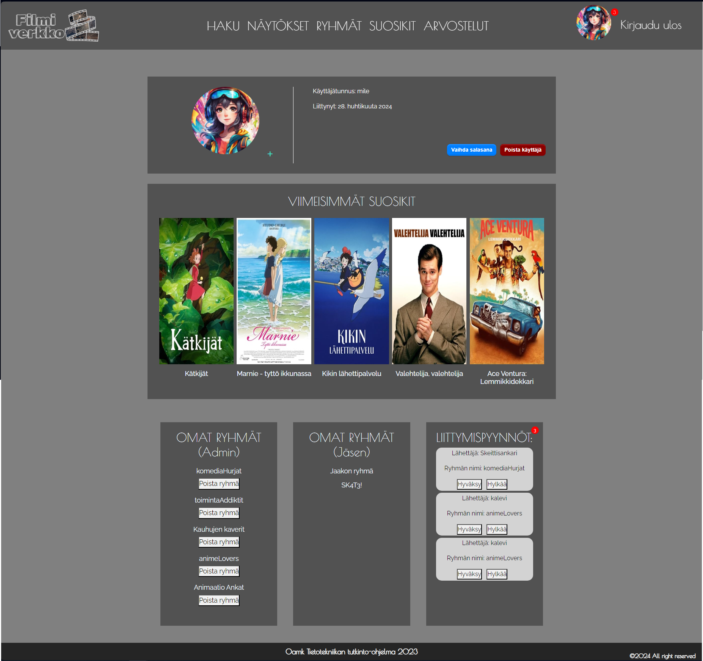
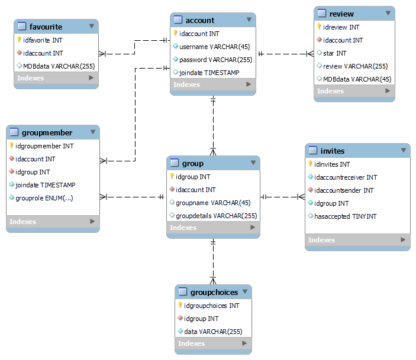
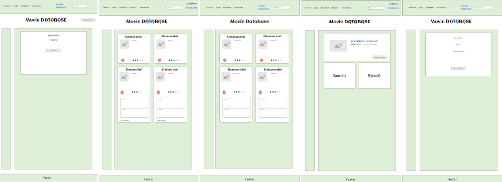

 
 

[Sovelluksen käyttöönotto](#sovelluksen-käyttöönotto) - [Sovelluksen ominaisuudet](#sovelluksen-ominaisuudet) - [Projektin toteutus](#projektin-toteutus) - [Ryhmän esittely](#ryhmän-esittely) - [Käytetyt tekniikat](#käytetyt-tekniikat)

## Esittely
Tässä projektissa luotiin sovellus, jolla voidaan etsiä elokuvia ja sarjoja sekä elokuvateattereiden näytösaikoja ja lisätä niitä omiin suosikkeihin sekä erinäisiin ryhmiin. Tämän sovelluksen toteutti Oulun ammattikorkeakoulun tieto- ja viestintätekniikan toisen vuosikurssin opiskelijat Web-ohjelmoinnin sovellusprojektin tuotoksena keväällä 2024. 

**Projektin esittelyvideo** [Sharepointissa](https://oamk-my.sharepoint.com/:v:/g/personal/c2komi04_students_oamk_fi/EZ4Ypuh5zhhAkEobBgFh6psBXxYjA51_Vamd_cTWgkRcyw?e=qcxGOc) ja **linkki** [sovellukseen](https://filmiverkko.onrender.com).
Projektin esittelyvideo linkki päivitetty 5.5.2024
---
### Sovelluksen käyttöönotto
1. Kloonaa repository 
2. Aja Npm install komento backend- ja frontend-kansioissa
3. Luo .env tiedosto backend -kansioon:
    >PG_HOST = 
    >
    >PG_PORT = 
    >
    >PG_DATABASE =
    > 
    >PG_USER = 
    >
    >PG_PW =
    >
    >user =
    > 
    >JWT_SECRET=
    >
    >TMDB_API_KEY= (The movie Databasesta API-avain) 
4. Npm start backend- ja frontend -kansioissa.

---

### Sovelluksen ominaisuudet
Sovelluksesta löytyy monenlaisia ominaisuuksia elokuvien ja sarjojen tutkimiseen. 

🏠 Aloitussivulle (kuva 1) saapuessa tulee näkyviin Finnkinon uusimman elokuvan traileri. Selatessa sivua alaspäin löytyy The Movie Databasen suosituimmat elokuvat ja sarjat.

*Kuva 1 Aloitussivu*

🔍 Haku-sivulta voidaan etsiä elokuvia ja sarjoja hakusanan, genren, vuosikymmenen ja arvosana-asteikon mukaan (kuva 2). Elokuvan tai sarjan kuvaa klikkaamalla saat kyseisestä elokuvasta tai sarjasta enemmän tietoa ja tietokannasta mahdollisesti löytyvät arvostelut (kuva 3). Jos olet kirjautuneena sivulle voit lisätä valitun elokuvan tai sarjan suosikkeihin, omiin ryhmiisi sekä kirjoittaa arvostelun elokuvasta. 

*Kuva 2 Hakusivu*

*Kuva 3 Haku-sivun media elementistä*

🎥 Näytökset-sivulta (kuva 4) pystytään etsimään elokuvanäytöksiä eri teattereista päivämäärän mukaan. Jos olet kirjautuneena sivulle, voit lisätä näytöksen omiin ryhmiisi. 

*Kuva 4 Näytökset-sivusta*

🧑‍🤝‍🧑 Ryhmät-sivulla (kuva 5) voidaan selailla ryhmiä ja kirjautuneena pyytää pääsyä ryhmiin, luoda ryhmä sekä nähdä niiden ryhmien sisällön (kuva 6), mihin kuulut. 

*Kuva 5 Ryhmät-sivusta*

*Kuva 6 Yksittäisen ryhmän sivusta*

🥇 Suosikit-sivuilta (kuva 7) löytyy kirjautuneena käyttäjän oma suosikkilista, jota pystyy jakamaan myös muille sivulla olevan linkin avulla. 

*Kuva 7 Suosikit-sivusta*

⭐ Arvostelut-sivulta (kuva 8) pystytään lukemaan arvosteluja, joita käyttäjät ovat elokuvista antaneet. Jos käyttäjä poistaa tunnuksensa hänen arvostelunsa säilyvät mutta niistä häviää nimimerkki.

*Kuva 8 Arvostelut-sivusta*

🦸 Kirjautuneena profiilikuvaa klikkaamalla päästään profiilisivulle (kuva 9), jossa näkyy tunnuksen tiedot ja profiilikuva, jonka voi vaihtaa. Tämän lisäksi näkyy viisi viimeisintä sinun suosikkilistallesi lisäämää elokuvaa tai sarjaa ja klikkaamalla Näytä lisää mennään Suosikit-sivulle. Viimeisenä näkyy alue, jossa on ryhmät, joihin käyttäjä kuuluu, sekä hallinnoimiesi ryhmien jäsenpyynnöt. 

*Kuva 9 Profiili-sivusta*

---

### Projektin toteutus 
📝 Projekti toteutettiin osana Tieto- ja viestintätekniikan koulutusta keväällä 2024. Projekti aloitettiin luennoilla sovelluksen rakentamisesta. Tämän jälkeen alkoi projektin toteutus. Ensimmäiset kaksi viikkoa olivat projektiryhmän muodostamista ja suunnittelua varten. Suunnittelun aikana teimme alustavat ER-kaaviot (kuvassa 10 lopullinen ER-kaavio), UI-suunnitelmat (kuva 11) ja Rest-dokumentaatio (lopullinen [Rest-dokumentaatio](https://documenter.getpostman.com/view/29936650/2sA3JDhRKW)). Suunnittelussa käytimme apuna Miro-sovellusta. 

*Kuva 10 ER-kaavio*

*Kuva 11 UI-suunnitelma*

🔨Toteutusvaiheessa hyödynsimme Discordia sekä GitHubin projektin hallintaa Kanban-mallilla. Tämä mahdollisti selkeän projektinhallinnan ja töiden jakamisen.  Projekti toteutettiin Visual Studio Codella, jossa käytettiin Reactia ja Nodea. Projektin toteutus kesti hiukan yli kuukauden. Pysyimme hyvin aikataulussa ja saavutimme kaikki toiminnallisuudet, joita tavoittelimme. 

---

### Ryhmän esittely

| Kehittäjät | |
| :---------------: | --- |
| [ ](https://github.com/ArttuA02) | Arttu Aalto -Ryhmän luonti ja ryhmien haku sivulle tietokannasta sekä ryhmän oman sivun alustava layout, suosikkien lisääminen- ja haku tietokannasta, infotekstien lisäämistä sekä kaikkea muuta pientä säätöä eri sivuille. |
| [ ](https://github.com/Ville-A) | Ville Ahola – Sovelluksen tietokannan luonti, ylläpito ja muokkaukset. Backendin runko. Käyttäjän rekisteröinti, kirjautuminen ja poistaminen (fullstack). Token-middleware suojattuihin endpointeihin. Ryhmäsivujen liittymispyyntöjen lähetys ja vastaanottaminen profiilisivulle (fullstack).   Ryhmän roolien luonti, admin ja user (fullstack). Yksikkötestauksien luonti Chai-kirjastolla. |
| [ ](https://github.com/AvaRaGane) | Juha-Matti Huhta – React-sovelluksen runko, oman näkymän(suosikkilistan) jakaminen, ryhmän sisällön lisääminen, ryhmän jäsenen poistaminen(frontend), leffa-arvostelujen selaaminen, leffa-arvostelujen lisääminen(backend), suodatettu haku(kriteerit), Finnkinon näytösaikojen hakeminen ja lisääminen ryhmään, suosikkien tulostuksen muokkaus sekä kaikkea muuta. |
| [ ](https://github.com/MikkoKom) | Mikko Komulainen - Haunrunko. Jäsenen poistaminen ryhmästä. Salasanan vaihto. Esittelyvideon kuvaus, juontaminen, editointi ja julkaiseminen. |
| [ ](https://github.com/Ereride) | Minna Leppänen - React-sovelluksen runko sekä sivuston tyylittely ja responsiivisuus. Lisäksi aloitussivu (fullstack), profiilisivu (fullstack) ja median ponnahdusikkunan (fullstack) sekä kaikkea muuta.|
 

### Käytetyt tekniikat

 

 
